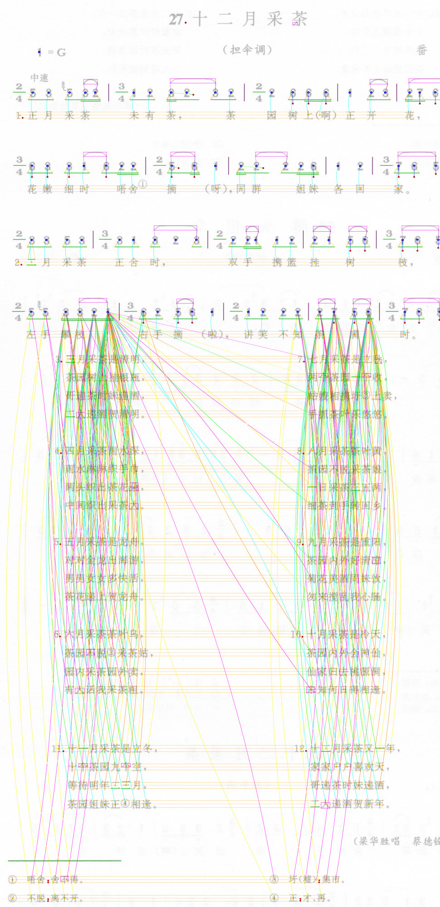

# Anthology of Chinese Folk Songs (v251103)

## Content

This dataset contains 8,659 songs from 11 volumes of the _Anthology of Chinese Folk Songs_. The dataset is divided into two subsets:

- **Lyrics-included subset** all pieces from Volume _Jiangsu I & II_ and _Guangdong_, with a total of 2,498 songs.

- **Melody-only subset**: all pieces from Volume _Hainan_, _Hebei I & II_, _Henan_, _Jilin_, _Shanghai_, _Sichuan I_ and _Tianjin_, with a total of 6,161 songs.

## Formats

- MIDI (`*.mid`)

- MusicXML (`*.musicxml`)

- Debug Visualization Images (`*.png`)

See Important Note below for more details.

## Repository Structure

```
.
├── lyrics-included/
│   ├── guangdong/
│   ├── jiangsu1/
│   └── jiangsu2/
└── melody-only/
    ├── hainan/
    ├── hebei1/
    ├── hebei2/
    ├── ...
    └── tianjin/

```

## Known issue: extra lyric lines in Volume Guangdong

Symptom: In some pieces of Volume _Guangdong_, the last phrases may include spurious lyric rows under the melody (see figure). This inflates the number of lyric lines.



Cause: The “attached lyrics” section printed below the score was mistakenly parsed as additional per-note lyric lines.

Suggested cleanup: Estimate the expected number of lyric rows from the majority of notes, e.g., compute the modal lyric-line count. For each note, keep only that many lyric lines and drop any extra rows. Most of the time this removes the appended “attached lyrics” while preserving genuine verse layers.

This issue will be addressed in the next version of the dataset.

## Important Note

Original scanned will not be made available to the public since they are copyrighted works.

## Other Archived Versions

(25/09/01) For CSMT2025 reviewers: [Anonymized-Subset-of-Anthology-of-Chinese-Folk-Songs](https://github.com/m-july/Anonymized-Subset-of-Anthology-of-Chinese-Folk-Songs)

